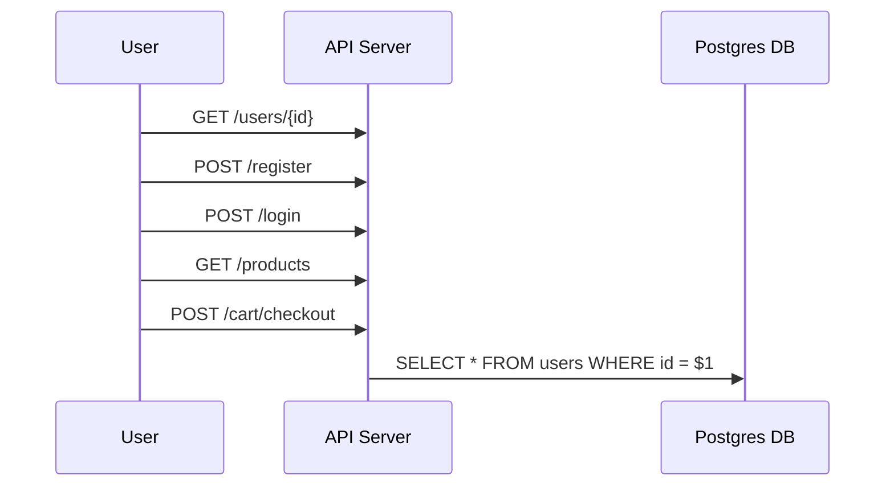

# Emporion API

The Emporion API is a transactional backend designed to handle various operations related to users, products, and orders.

## Design Principles

The API is designed with the following principles in mind:

1. **RESTful**: The API follows the principles of Representational State Transfer (REST). It uses standard HTTP methods like `GET`, `POST`, `PUT`, `DELETE` to perform operations on the resources.

2. **Resource-Oriented**: Each entity like a user, product, or order is considered a resource and has a corresponding endpoint.

3. **Stateless**: Each request from the client to the server must contain all the information needed to understand and process the request.

4. **Client-Server Architecture**: The client and the server are separate entities that communicate over HTTP. This separation allows the client and server to be developed and deployed independently.

5. **Layered System**: The architecture is composed of multiple layers, each with specific responsibilities. This separation of concerns aids in maintainability and scalability.

## API Endpoints

Here are some of the main endpoints provided by the API:

- `GET /users/{id}`: Fetches the details of a user with the given ID.
- `POST /register`: Registers a new user.
- `POST /login`: Authenticates a user and returns a token.
- `GET /products`: Fetches a list of all products.
- `POST /cart/checkout`: Processes a user's cart and places an order.

### Diagram

## Database

The API uses a Postgres database to store and retrieve data. The database schema is designed to efficiently support the API operations.

## Testing

The API includes unit tests to ensure the correctness of the code. The tests are located in the `service` directory, with each service having its own test file.
