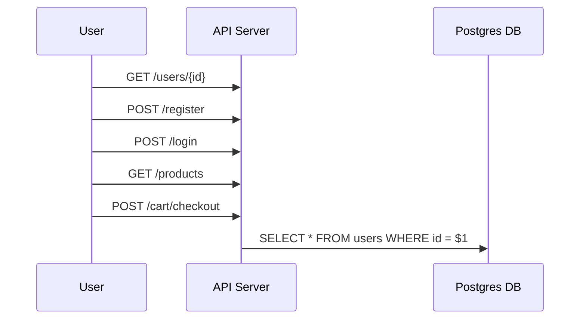

# emporion
Transactional API backend

### Diagram

```mermaid
sequenceDiagram
    participant U as User
    participant S as API Server
    participant P as Postgres DB

    U->>S: GET /users/{id}
    U->>S: POST /register
    U->>S: POST /login
    U->>S: GET /products
    U->>S: POST /cart/checkout
    S->>P: SELECT * FROM users WHERE id = $1
```